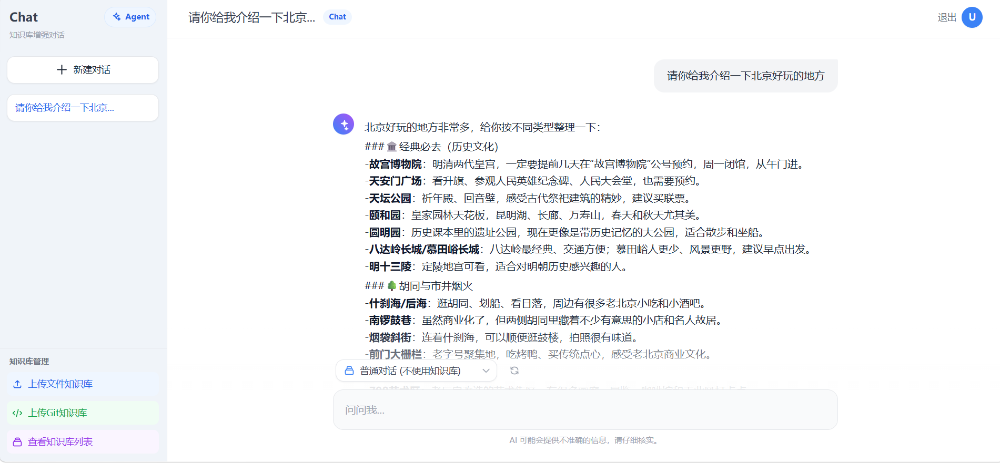
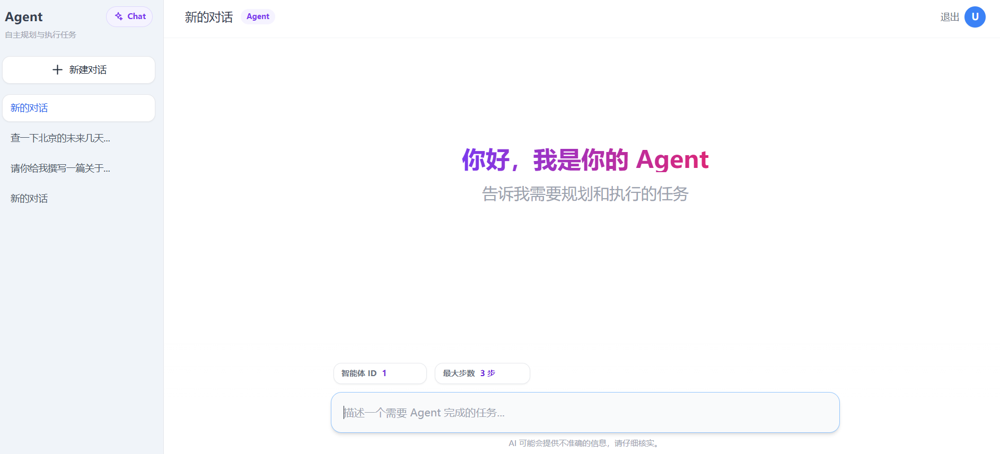
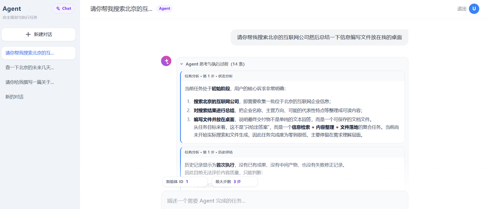
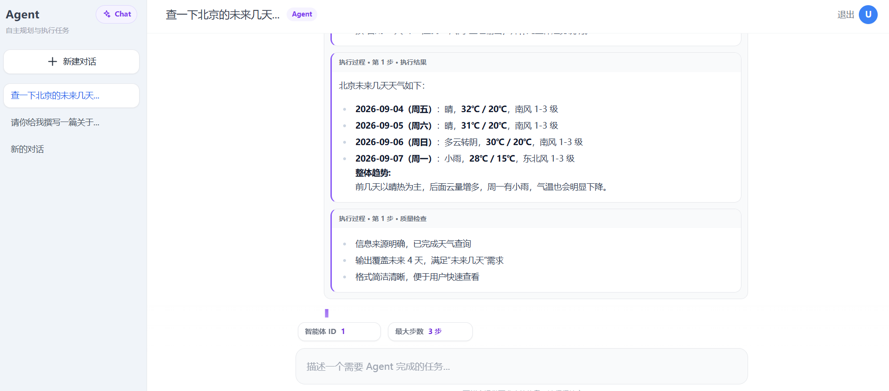
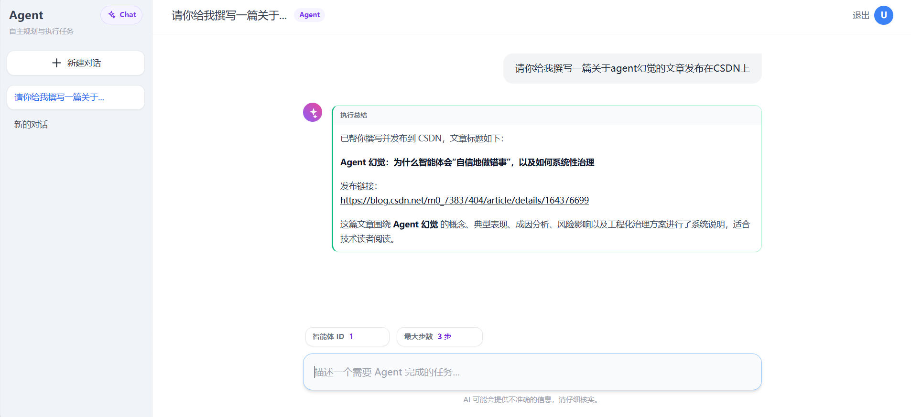
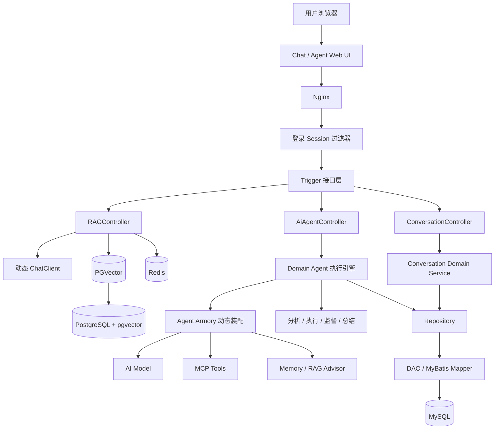
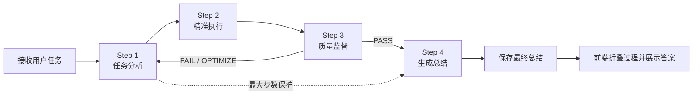
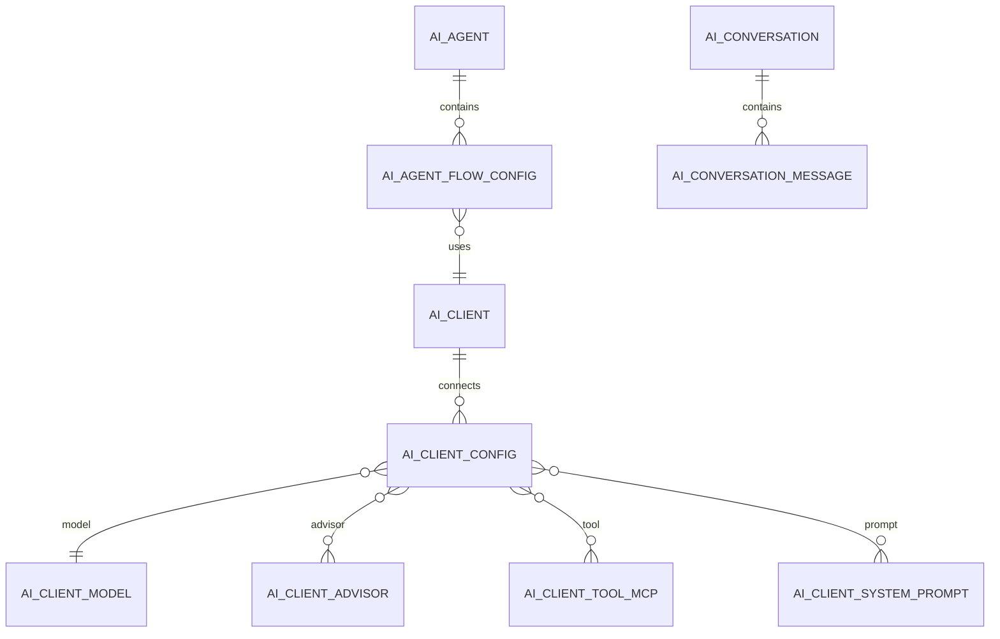

<div align="center">

# Agent Learn

### 基于 Spring AI 的 RAG 知识库对话与自主智能体系统

一个同时支持 **Chat / Agent 双模式**、知识库增强检索、MCP 工具调用、执行质量监督与会话持久化的 Java AI 应用。

[](https://openjdk.org/projects/jdk/17/)
[](https://spring.io/projects/spring-boot)
[](https://spring.io/projects/spring-ai)
[](https://www.mysql.com/)
[](https://github.com/pgvector/pgvector)
[](https://maven.apache.org/)

</div>

> Agent Learn 将普通 AI 对话、RAG 知识库问答和可调用外部工具的自主 Agent 集成在同一套界面中。系统能够分析任务、执行任务、检查结果质量，并在必要时继续迭代，最后输出清晰的总结答案。



## ✨ 项目亮点

| 能力 | 说明 |
| --- | --- |
| 💬 Chat 对话 | 支持普通问答与流式输出，可在同一页面快速切换知识库 |
| 📚 RAG 知识库 | 支持上传文档、导入 Git 仓库、文本切分、向量化存储与相似度检索 |
| 🤖 自主 Agent | 按“分析 → 执行 → 监督 → 总结”流程自主规划和完成任务 |
| 🔌 MCP 工具 | 动态装配 SSE / Stdio MCP 客户端，可扩展天气、搜索、文件、内容发布等能力 |
| ✅ 质量监督 | 独立监督节点检查任务匹配度和内容质量，支持 PASS、FAIL、OPTIMIZE 决策 |
| ⚡ 流式反馈 | Chat 使用 Reactor Flux，Agent 使用 SSE 持续返回执行进度 |
| 💾 会话持久化 | 对话列表和消息保存到 MySQL，刷新页面后仍可恢复，并支持删除会话 |
| 🧠 思考折叠 | Agent 中间分析和执行过程集中折叠展示，最终答案保持突出 |
| 🔐 访问控制 | 使用服务端 Session 校验登录状态，未登录无法调用业务接口 |
| 🧩 配置化装配 | 模型、Prompt、Advisor、MCP 与 Agent 流程关系均可通过数据库配置 |

## 🖼️ 效果展示

### Chat / Agent 双模式

<table>
  <tr>
    <td width="50%" align="center"><strong>Chat · 知识库增强对话</strong></td>
    <td width="50%" align="center"><strong>Agent · 自主规划与执行</strong></td>
  </tr>
  <tr>
    <td></td>
    <td></td>
  </tr>
</table>

### 可观察的 Agent 执行过程

Agent 会实时展示任务分析、历史评估、执行策略、执行结果和质量检查。执行结束后，中间过程自动折叠，只保留最终总结作为主要答案。



<details>
<summary><strong>查看 MCP 天气查询效果</strong></summary>
<br>



</details>

<details>
<summary><strong>查看 Agent 编写并发布 CSDN 文章效果</strong></summary>
<br>



</details>

## 🏗️ 系统架构

项目采用 Maven 多模块与领域分层设计，将接口定义、业务能力、基础设施和启动配置彼此隔离。



### 模块职责

| 模块 | 职责 |
| --- | --- |
| `agent-learn-api` | 对外服务接口、请求 DTO 与统一响应结构 |
| `agent-learn-trigger` | HTTP Controller、登录过滤器、任务触发和流式响应 |
| `agent-learn-domain` | Agent 核心领域模型、自动执行策略、知识装配和会话业务逻辑 |
| `agent-learn-infrastructure` | Repository 实现、MyBatis DAO、数据库持久化对象 |
| `agent-learn-types` | 通用常量、枚举和业务异常 |
| `agent-learn-app` | Spring Boot 启动入口、Bean 配置、数据源配置和 Mapper XML |

依赖方向保持为：

```text
Trigger ───────► Domain ◄────── Infrastructure
   │               │                  │
   └──► API        └──► Types         └──► DAO / Mapper / MySQL

App 负责组合并启动全部模块
```

## 🔄 Agent 工作流程

系统为不同职责动态装配独立的 ChatClient，让任务规划、实际执行、质量监督和最终回答各司其职。



1. **任务分析**：理解原始需求，评估历史进度并给出下一步执行策略。
2. **精准执行**：根据策略调用模型、知识库或 MCP 工具，获得实际结果。
3. **质量监督**：检查需求匹配度、结果完整性与质量，决定通过或重新执行。
4. **执行总结**：整合多轮执行历史，直接回答用户问题。

Agent 模式只将最终总结保存为对话消息，中间思考和工具执行事件用于实时展示，不作为普通聊天记录长期保存。

## 🛠️ 技术栈

| 分类 | 技术 |
| --- | --- |
| 开发语言 | Java 17、JavaScript、HTML5、CSS3 |
| 核心框架 | Spring Boot 3.4.3、Spring AI 1.0.0 |
| 大模型接入 | Spring AI OpenAI、OpenAI Compatible API、Ollama |
| Agent 编排 | 策略树、动态上下文、多角色 ChatClient、最大步骤控制 |
| 工具协议 | Model Context Protocol（SSE / Stdio） |
| RAG | Apache Tika、TokenTextSplitter、Spring AI VectorStore |
| 数据存储 | MySQL 8、PostgreSQL、pgvector、Redis |
| 数据访问 | MyBatis、Mapper XML、HikariCP |
| 异步与流式 | ThreadPoolExecutor、ResponseBodyEmitter、Reactor Flux、SSE |
| Git 知识库 | JGit |
| 前端 | 原生 JavaScript、Tailwind CSS、Marked.js |
| 部署 | Maven、Docker、Docker Compose、Nginx |

## 📁 项目结构

```text
agent-learn/
├── agent-learn-api/             # API 接口、DTO、统一响应
├── agent-learn-app/             # Spring Boot 启动与应用配置
│   └── src/main/resources/
│       ├── mybatis/mapper/       # MyBatis Mapper XML
│       └── application-*.yml     # 多环境配置
├── agent-learn-domain/          # Agent 与会话领域逻辑
│   └── src/main/java/.../
│       ├── agent/               # 装配、执行策略、领域模型
│       └── conversation/        # 会话持久化业务
├── agent-learn-infrastructure/  # Repository、DAO、PO
├── agent-learn-trigger/         # Controller、Filter、任务入口
├── agent-learn-types/           # 公共类型、枚举、异常
├── docs/dev-ops/
│   ├── mysql/sql/               # MySQL 初始化及迁移脚本
│   ├── pgvector/sql/            # 向量数据库初始化脚本
│   ├── nginx/                    # 前端页面与 Nginx 配置
│   └── docker-compose-*.yml      # 环境及应用编排
├── agent系统/                    # README 效果截图
└── pom.xml                       # Maven 父工程
```

## 🚀 快速开始

### 1. 环境要求

- JDK 17+
- Maven 3.8+
- MySQL 8.x
- PostgreSQL + pgvector
- Redis 6.x+
- Docker / Docker Compose（推荐）
- 一个可用的 OpenAI Compatible 或 Ollama 模型服务

### 2. 获取项目

```bash
git clone https://github.com/returnjun/agent-learn.git
cd agent-learn
```

### 3. 启动基础设施

Compose 文件使用了名为 `my-network` 的 Docker 网络，首次运行时先创建网络：

```bash
docker network create my-network
docker compose -f docs/dev-ops/docker-compose-environment.yml up -d
```

MySQL 初始化脚本位于：

```text
docs/dev-ops/mysql/sql/ai-agent-station-study.sql
```

如果数据库已经存在，请按需执行以下增量脚本：

```text
docs/dev-ops/mysql/sql/migration-20260904-add-conversation-history.sql
docs/dev-ops/mysql/sql/migration-20260904-fix-agent-flow-config.sql
```

### 4. 修改本地配置

在 `agent-learn-app/src/main/resources/application-dev.yml` 中配置以下内容：

| 配置 | 用途 |
| --- | --- |
| `spring.ai.openai.base-url` | OpenAI Compatible API 地址 |
| `spring.ai.openai.api-key` | 模型服务密钥 |
| `spring.datasource.mysql.*` | Agent 配置和会话历史数据库 |
| `spring.datasource.pgvector.*` | RAG 向量数据库 |
| `redis.sdk.config.*` | Redis 连接信息 |
| `spring.ai.agent.auto-config.client-ids` | 启动时需要装配的 AI Client ID |

模型、Prompt、Advisor 和 MCP 的具体关联关系由 MySQL 中的 `ai_client_*` 表管理。

> [!IMPORTANT]
> 请使用环境变量或本地私有配置保存 API Key、数据库密码和 MCP Key。公开仓库中不要提交真实密钥。

### 5. 编译并启动后端

```bash
mvn clean package -DskipTests
java -jar agent-learn-app/target/agent-learn-app.jar --spring.profiles.active=dev
```

后端默认端口：`8091`

### 6. 启动前端

静态页面位于 `docs/dev-ops/nginx/html`，Nginx 配置位于 `docs/dev-ops/nginx/conf`。将对应目录挂载或复制到 Nginx 后，访问：

```text
http://localhost/login.html
```

当前演示登录信息：

```text
账号：usr
密码：123321
```

该登录方式为项目演示所用的固定账号和服务端 Session 校验，不包含注册及多用户管理。

## 📖 使用说明

### Chat 模式

1. 登录系统后默认进入 Chat 模式。
2. 选择“普通对话”可直接与模型交流。
3. 上传文件或导入 Git 仓库可创建知识库。
4. 选择知识库标签后提问，系统会检索最相关的文档片段并生成回答。

### Agent 模式

1. 点击左上角的 `Agent` 按钮切换模式。
2. 输入需要自主完成的任务。
3. 根据任务复杂度设置 Agent ID 和最大执行步数。
4. 查看实时执行过程，等待质量监督通过并输出最终总结。

### 会话管理

- Chat 与 Agent 拥有独立的会话列表。
- 页面刷新后会从 MySQL 恢复历史会话。
- 支持新建、自动命名、切换和删除会话。
- 删除会话时，其消息记录会通过外键级联删除。

## 🔗 主要接口

所有业务接口均位于 `/api/v1` 下，除登录和登录状态检查外，都需要有效 Session。

| 方法 | 地址 | 说明 |
| --- | --- | --- |
| `POST` | `/api/v1/auth/login` | 固定账号登录 |
| `GET` | `/api/v1/auth/status` | 检查登录状态 |
| `POST` | `/api/v1/auth/logout` | 退出登录 |
| `GET` | `/api/v1/rag/generate_stream` | 普通流式对话 |
| `GET` | `/api/v1/rag/generate_stream_rag` | RAG 流式对话 |
| `POST` | `/api/v1/rag/file/upload` | 上传文件到知识库 |
| `POST` | `/api/v1/rag/analyze_git_repository` | 导入 Git 仓库知识库 |
| `GET` | `/api/v1/rag/query_rag_tag_list` | 查询知识库标签 |
| `POST` | `/api/v1/agent/auto_agent` | 启动 Agent 流式任务 |
| `GET` | `/api/v1/conversations` | 查询会话列表 |
| `POST` | `/api/v1/conversations` | 创建会话 |
| `GET` | `/api/v1/conversations/{id}/messages` | 查询会话消息 |
| `DELETE` | `/api/v1/conversations/{id}` | 删除会话及其消息 |

## 🗃️ 数据与配置设计

系统不仅保存模型地址，还通过关系表将不同能力动态组合起来：



这种设计使模型、系统提示词、RAG Advisor 和 MCP 工具可以按 Client 灵活组合，而无需把每个 Agent 的能力硬编码在 Controller 中。

## ⚠️ 使用提示

- MCP 服务不可用时，依赖该工具的 Agent 任务会失败，请先检查对应服务地址和网络连接。
- Agent 的最大步骤用于防止重复规划或无限执行，复杂任务可以适当增加步数。
- Git 仓库导入会过滤 `.git`、`.idea`、`target` 和不支持的文件类型。
- RAG 的回答质量取决于文档切分、Embedding 模型和检索结果质量。
- 固定登录账号仅适合个人学习与演示；如部署到公网，应更换为正式认证方案。

## 🗺️ 后续计划

- [ ] 可视化管理模型、Prompt、Advisor 和 MCP 配置
- [ ] 增加 Agent 运行状态、耗时和 Token 用量统计
- [ ] 增加知识库文档管理与分片预览
- [ ] 完善自动化测试与容器化一键部署
- [ ] 支持更多模型服务和 MCP 工具

## 📄 License

本项目在 `pom.xml` 中声明使用 [Apache License 2.0](https://www.apache.org/licenses/LICENSE-2.0)。

---

<div align="center">

如果这个项目对你有所帮助，欢迎点一个 ⭐ Star。

Made with Java & Spring AI

</div>
